# Specific is Smart

*By Sachin Dixit*

## It Starts With…

A picture of the integration landscape you begin from:

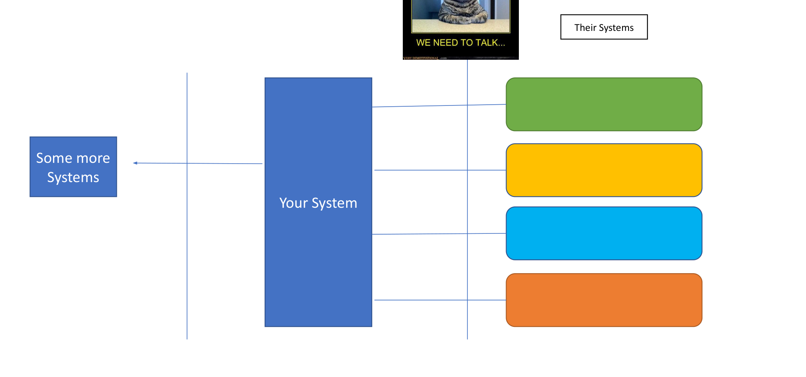

- **Your System**
- **Their Systems**
- **Some more Systems**


## Protocols are different

Every system you connect to talks over a different protocol:


- Their Systems ↔ Your System ↔ Some more Systems
- `http`
- `ftp`
- `wss`
- Some blah

## Semantics are different

The same idea is exposed through different service styles:

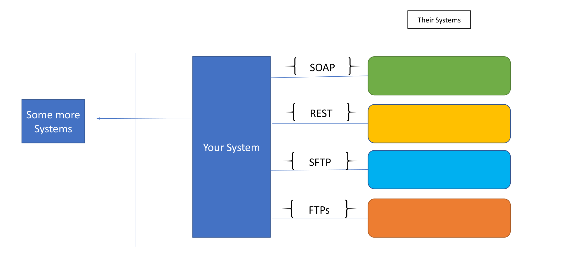

- Their Systems ↔ Your System ↔ Some more Systems
- SOAP
- REST
- SFTP
- FTPs

## Formats are different

And the payload formats never line up either:


- Their Systems ↔ Your System ↔ Some more Systems
- `< XML >`
- `{ JSON }`
- `C,S,V`
- `|s|e|p|e|r|a|t|e|d|`

## Key Problem

<table>
<tr>
<td valign="top">

- Same spelling != Same meaning
  - Different spelling != Different meaning
- Same spelling != Same format/validations
- Same key != Same encoding
- Same packet != Same functional semantics
- Same key != Same Cardinality

</td>
<td valign="top">

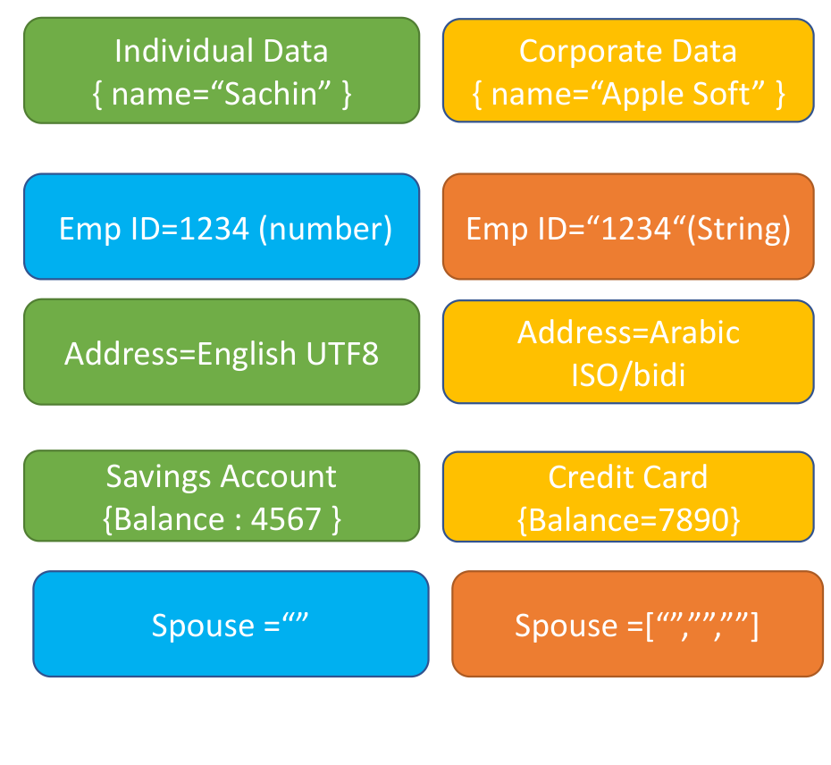

</td>
</tr>
</table>

<details><summary>Text version of the comparison</summary>

| Individual Data | Corporate Data |
| --- | --- |
| `{ name="Sachin" }` | `{ name="Apple Soft" }` |
| `Emp ID=1234` (number) | `Emp ID="1234"` (String) |
| `Address=English UTF8` | `Address=Arabic ISO/bidi` |
| Savings Account `{Balance : 4567 }` | Credit Card `{Balance=7890}` |
| `Spouse =""` | `Spouse =["","",""]` |

</details>

## Interpretation Problem

<table>
<tr>
<td valign="top">

- Hidden Processing clues
- Hidden Interrelations

</td>
<td valign="top">

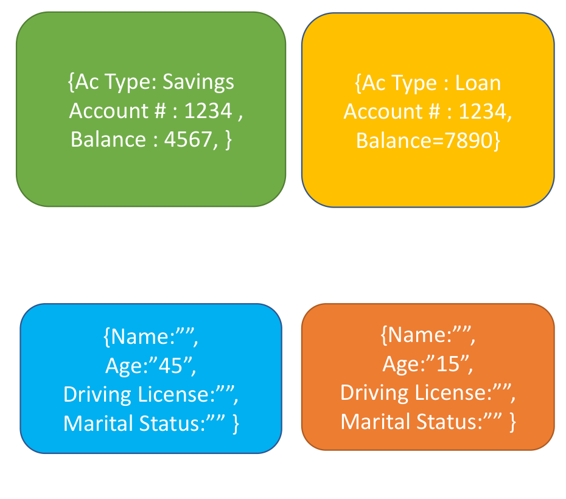

</td>
</tr>
</table>

<details><summary>Text version of the packets</summary>

| | |
| --- | --- |
| `{Ac Type: Savings, Account # : 1234, Balance : 4567, }` | `{Ac Type : Loan, Account # : 1234, Balance=7890}` |
| `{Name:"", Age:"45", Driving License:"", Marital Status:"" }` | `{Name:"", Age:"15", Driving License:"", Marital Status:"" }` |

</details>

## Data Mess

<table>
<tr>
<td valign="top">

- Too Much Data
- Nesting : Pure nesting, graph loops, self reference, Matrix reference, Defaulting

</td>
<td valign="top">

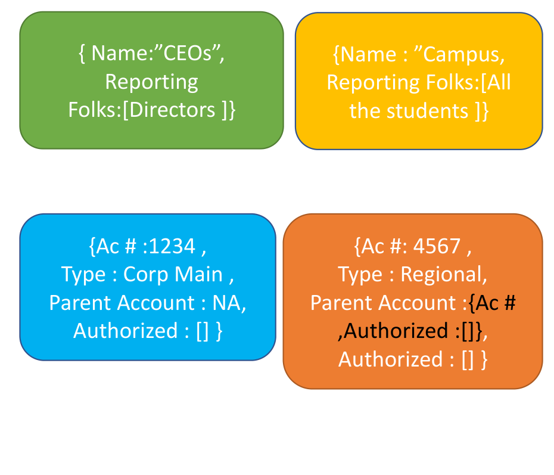

</td>
</tr>
</table>

<details><summary>Text version of the payloads</summary>

| | |
| --- | --- |
| `{ Name:"CEOs", Reporting Folks:[Directors ]}` | `{Name : "Campus, Reporting Folks:[All the students ]}` |
| `{Ac # :1234, Type : Corp Main, Parent Account : NA, Authorized : [] }` | `{Ac #: 4567, Type : Regional, Parent Account :{Ac # ,Authorized :[]}, Authorized : [] }` |

</details>

## Data Destination Differences

The same data has to fan out to many destinations — Your System, Some System, Some more Systems — each expecting something slightly different.

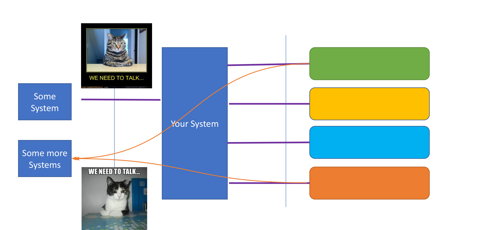

 

## Data Destination Differences (Enterprise Integration Patterns)

The recurring shapes of this problem are captured by the Enterprise Integration Patterns catalog:

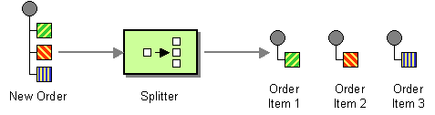
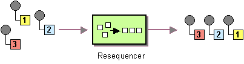
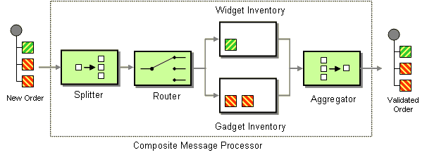
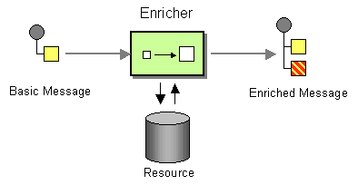
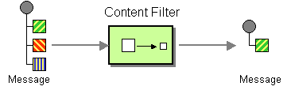
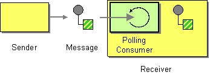
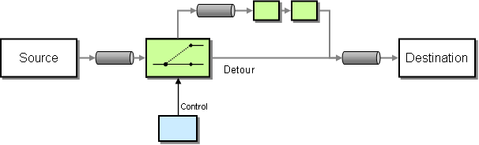
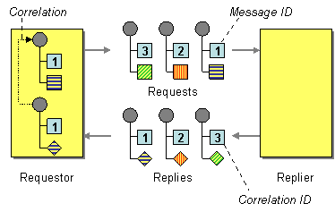

*© Gregor Hohpe, Bobby Woolf*

## One thing I don't know Why…

Usual Attempts to handle these situations:

- Standardized format
- Generic Services
- Automatic codeless
- Dynamic Flow adapter
- UI Based Mapper

## Standardized format

<table>
<tr>
<td valign="top">

- Standardization
  - Saves Effort
  - Less Bugs
  - Faster Rollout
  - World Peace
- Accumulation
  - Pushes work under carpet
  - Much Afterwork
  - If-then style entangled code
  - Difficult Bugs
  - Product cant Evolve
  - Very Open to Hacking : UDFs/Open to any data type fields

</td>
<td valign="top">

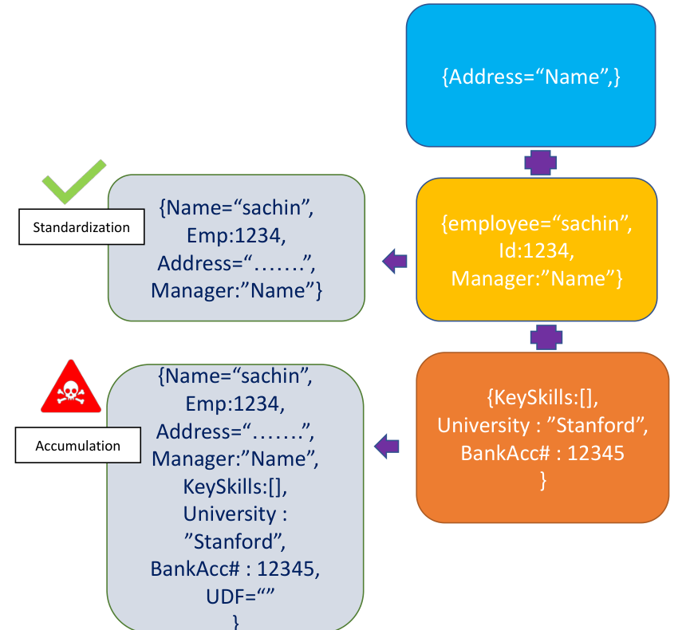

</td>
</tr>
</table>

<details><summary>Text version of the payload flow</summary>

- Inputs get combined — `{Address="Name",}` + `{employee="sachin", Id:1234, Manager:"Name"}` + `{KeySkills:[], University : "Stanford", BankAcc# : 12345 }`
- Standardization (good case) → `{Name="sachin", Emp:1234, Address="…….", Manager:"Name"}`
- Accumulation (the trap) → `{Name="sachin", Emp:1234, Address="…….", Manager:"Name", KeySkills:[], University : "Stanford", BankAcc# : 12345, UDF=""}`

</details>

## Generic Services

<table>
<tr>
<td valign="top">

- Another name for accumulated payload with mannny fields
- Insists on one service to handle them all
- At times banks on generic tables to load the segregate data !
- As cute as a trap can get

</td>
<td valign="top">

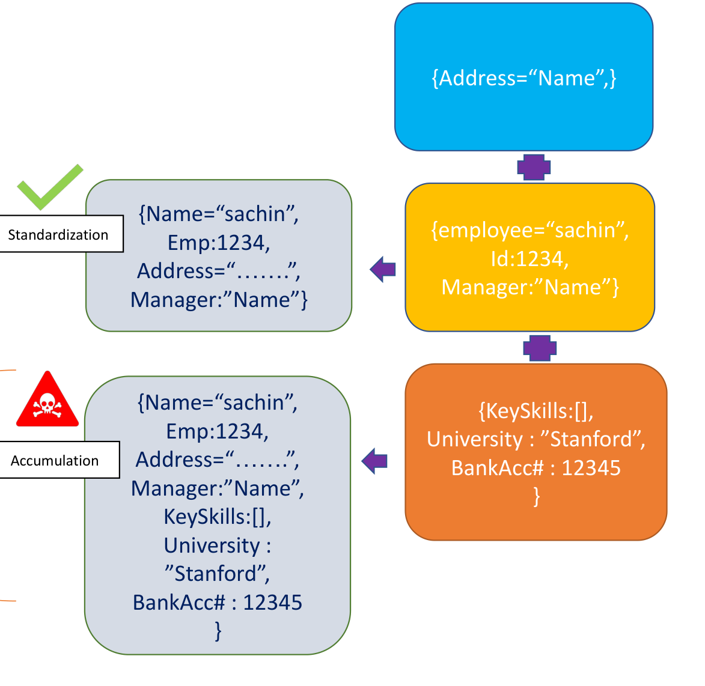

</td>
</tr>
</table>

<details><summary>Text version of the payload flow</summary>

- Standardization (good case) → `{Name="sachin", Emp:1234, Address="…….", Manager:"Name"}`
- Accumulation (the trap) → `{Name="sachin", Emp:1234, Address="…….", Manager:"Name", KeySkills:[], University : "Stanford", BankAcc# : 12345 }`

</details>

## Automatic codeless

- Integrations are known
- Robust components
- Mature (microservices ?) Architecture
- Finite Possibilities
- Real CD


*© Inc.com*

## Dynamic Flow Adapter

- Pre made components
- Mix and Match
- Extensible at Runtime, DSL
- Often comes with UI/Studio
- Usually the sweet spot
- Hidden Engine beneath
- Can morph into ESB ☹
- Faster way to MVP !

Example routing DSL (Apache Camel):

```java
from("direct:a")
  .choice()
    .when(header("foo").isEqualTo("bar")) .to("direct:b")
    .when(header("foo").isEqualTo("cheese")) .to("direct:c")
  .otherwise() .to("direct:d")
```


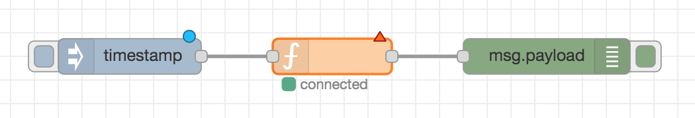
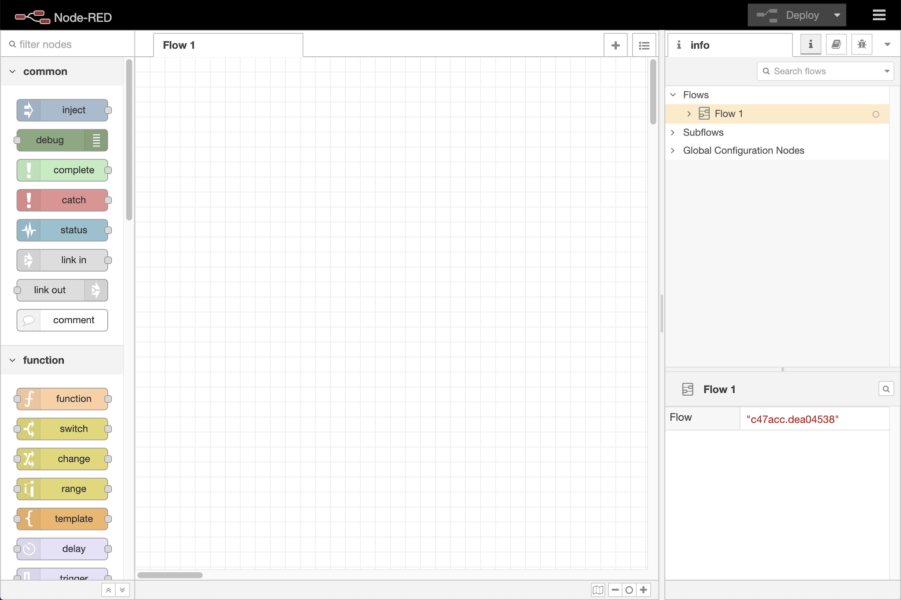
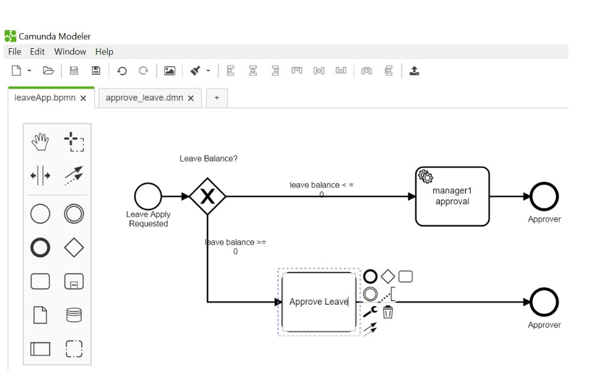

## UI Based Mapper

- Is it Dynamic Flow Adapter with UI
  - OR
- Generic Pattern with UI ?
- Genuine UI Mappers exist
  - Mostly for data in-data out
  - Can also into sql query mapper over nosql !

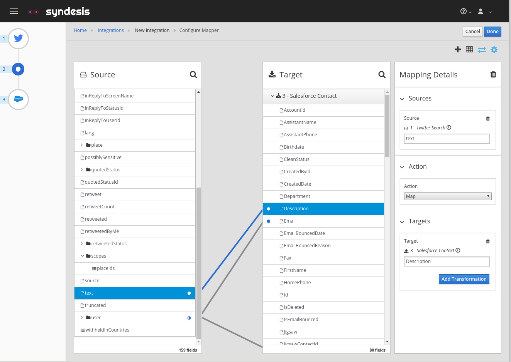

## In the End

- Generic pushes work downstream
- Code complexity is high
- Effort is often hidden out of sight
- Agility is lowered
- Security might be at risk
- DBs become bulky
- Performance is bad-ish
- Other monolith era issues
- Watch out of Serverless-ESBs

## Generic pushes work downstream

```
#feed={Name:"",Phone:"",IsJointAc:"",IsCorpAc:"",JtAcHolder:"",CorpApprovers:["","",""],MasterCorpAcc:"",isMultiCurrency:"",ApprovedCurrencies:["",""""]}

public class MyClass {
  String Name ;
  Boolean IsJointAcc
  String[] CorpApproveers //what if approvers were object modelled ??
  }
}
```

- How your db queries look like now ?
- How your method signatures look like ?
- How big-small your objects look like ?
- All these if thens are the extra work you need to do

## Code complexity is high

```python
feed={Name:"",Phone:"",IsJointAc:"",IsCorpAc:"",JtAcHolder:"",CorpApprovers:["","",""],MasterCorpAcc:"",isMultiCurrency:"",ApprovedCurrencies:["",""""]}

Class ProcessFeed:
def handleAccount(feed):
    if isJointAc:
        do.something(feed.JtAcHolder)
    if isCorpAc and isMutiCurrency :
        do.somethingElse(feed.ApprovedCurrencies ,feed.Name)
    if ! isJointAcc:
        someformater.formatToMobile(feed.Phone)
```

## Effort is often hidden out of sight

- Specific code can be linearly estimated
- How do you account for bulky objects ( often S-M-C )
- Did you account for conditional processing
- Did you account of cross class, cross conditional coding ?
- How do you account of multiple where clause -nested queries
- Build time ?
- Testing time ?
- Refactoring time ?
- Etc etc etc

## Agility is lowered

- Specific Code
  - Small Class-method-block to modify
  - Easy to change
  - Easy to build
  - Easy to rest
- New team members can onboard quickly
- Small code gets refactored often ! Less tech debt
- Small code follows design patterns
- Precise debates on story points can happen here

## Security might be at risk

- Sql Injection
- Code Injection
- Too many injection attacks ; Check here
  - https://owasp.org/www-community/attacks
- XML attacks https://cheatsheetseries.owasp.org/cheatsheets/XML_Security_Cheat_Sheet.html
- Memory oriented DoS attempts
- Shared State, Global variables
- Inadvertent feature disclosure !

## DBs become bulky

- Generic design result into Denormalization
  - Big DW style tables
  - Slow Queries
  - Complex queries
  - Tendency to create generic queries !
  - Index goes for a toss
  - In few cases ; Stored Procedures
- Inclination to store generic UDT as files into DB
  - Pushes the sql time work to code !
  - DB evolution becomes impossible
  - Index goes for toss , poor index

## Performance is bad-ish

- Generic Code follows no Design Pattern
  - Intern invites upstream and downstream bulkiness
- Big Object + Complex Code + Complex query = Bad Performance
- Even the Config files are bulky
- Even the log files are bulky
- Memory requirements go up
- Compiler -Cache-Runtime Optimizations might not happen !
- Bulky deployable -Bulky containers -Less scalable

## Other monolith era issues

- What design patterns ?
- What SOLID principles ?
- What High cohesion Low Coupling ?
- What layering ?
- What microservices ?
- What AutoScaling ?
- What 12 factor ?
- What cloud native ?
- What EIP?
- What OOAD ?

## In the End

- Generic pushes work downstream
- Code complexity is high
- Effort is often hidden out of sight
- Agility is lowered
- Security might be at risk
- DBs become bulky
- Performance is bad-ish
- Other monolith era issues
- Watch out of Serverless-ESBs

## It Does ~~n't event~~ matter

- NoSQL Help ( RDBMS style thinking and structure is a baggage )
- Dynamic languages help
- Proven Engines help
- DIY in case of MVPs , Niches
- Good old Decoupling is still gold standard
- Specific ➡ Precise – Agile - Less Bug - Evolvable - Lightweight - Performant
- Design is distilling Specific from Generic
- Too much generic is also reflection point about team dynamics

## Thanks


